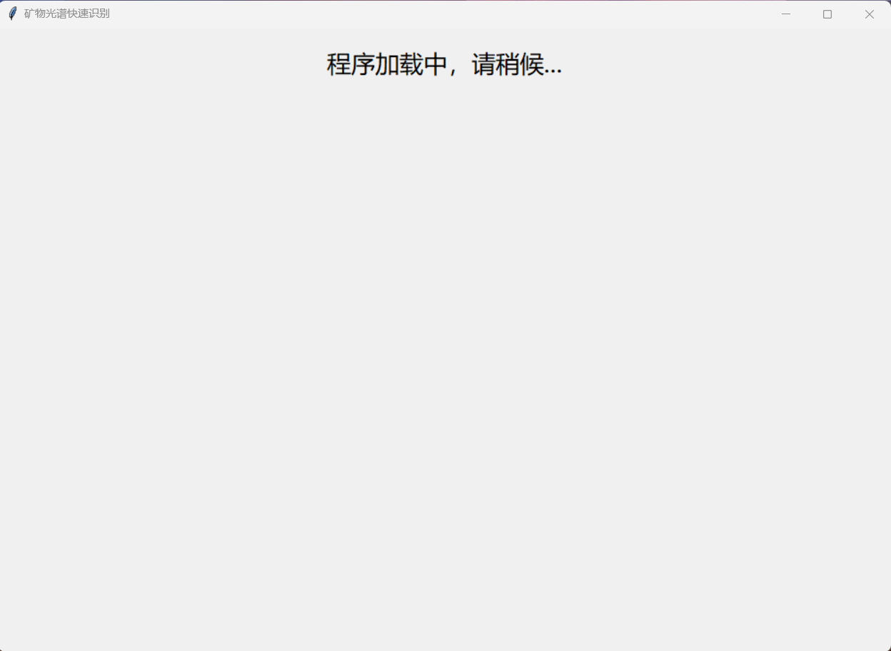
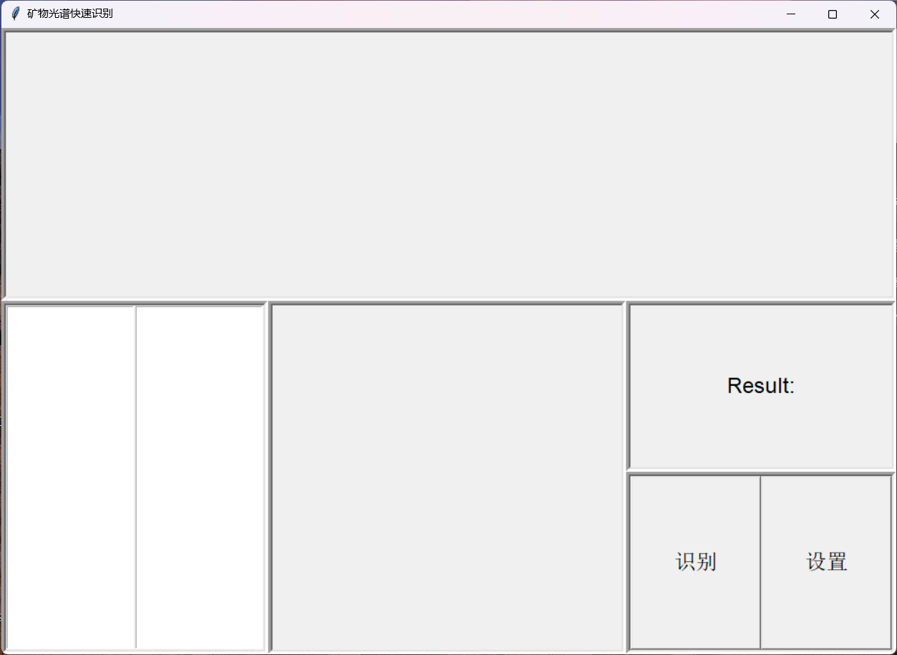
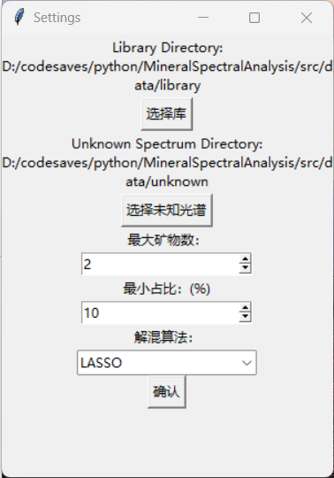
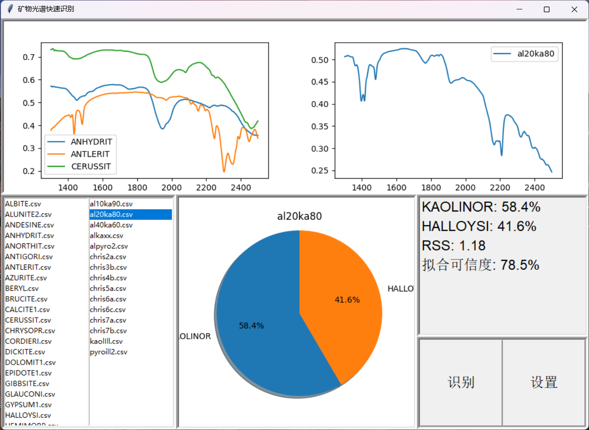

# 矿物光谱快速识别软件

使用Lasso回归，岭回归，线性回归对光谱解混，实现光谱成分分析。

## 文件结构

`data`目录下存放矿物的SWIR光谱数据文件。txt为原数据文件，csv是从txt读取的数据文件。本软件使用的是`library`和`test`中的文件。

`src`存放源码。

1. `src/dist`存放可执行的二进制文件。

2. `src/spectra`存放精简后的光谱数据文件。

`demix.py`是光谱解混算法文件，可以被其他程序所引用。

`gui.py`是GUI文件，用以创建用户界面，使用光谱解混算法识别光谱。

其他`.ipynb`文件是“实验性”文件，是本软件编写`demix.py`前走过的路。其中`dataprocess.ipynb`是用来从txt文件中提取光谱数据转换为csv文件。

`msa.py`是过程性文件，用来给同学在QT中引用，测试是否能正常使用，没有重要用途。

## 运行该项目

从`src/dist/`目录下找到exe可执行文件即可运行。

程序需要读取的光谱数据文件可以从`src/data/`目录下进行加载。

## 开发该项目

你需要配置你的python环境，本项目的环境配置见msa.yml。你可以使用`conda create -n <new_env_name> -f msa.yml`来使用msa.yml进行环境的创建。

在demix.py文件作为python模块，实现光谱识别的相关算法，其中包括根据读取的光谱文件创建光谱库，预处理，光谱解混等。

在gui.py文件调用了demix.py模块，使用Tkinter框架实现GUI界面。

## 程序截图

